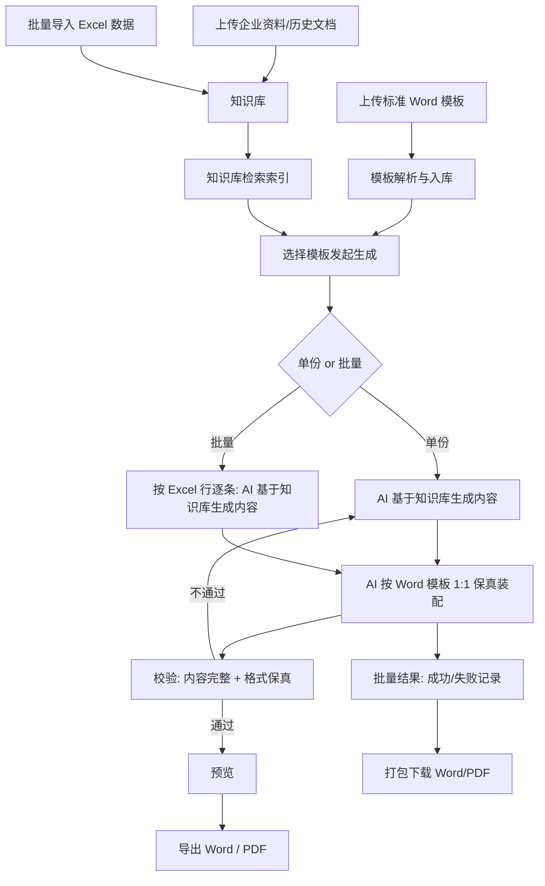

# doc-flow 产品流程（MVP）

## 核心命题

结合 AI 与企业知识库，按标准 Word 模板 1:1 保真生成正式文档。AI 完成内容生成与模板装配两个环节；仅支持 Word 模板与 Word/PDF 产出；Excel 批量导入的内容作为知识库的一部分。

## 产品流程图

## 流程要点

- AI 完成两个动作：**生成内容** → **按模板 1:1 保真装配**（模板提供格式骨架）
- Excel 批量导入的数据进入知识库，AI 基于知识库逐行生成，而非字段映射填充
- 校验在装配后：内容完整性 + 格式保真度双查，不通过回到 AI 重生成
- 单份与批量共用同一 AI 链路
